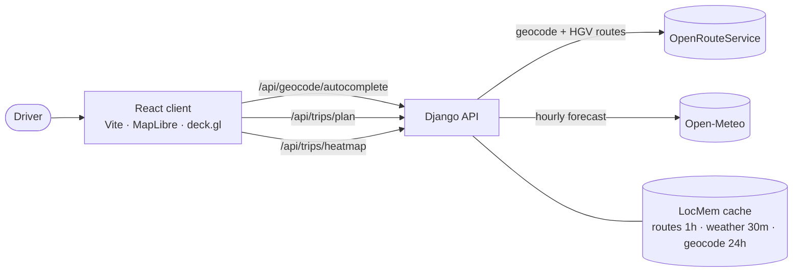
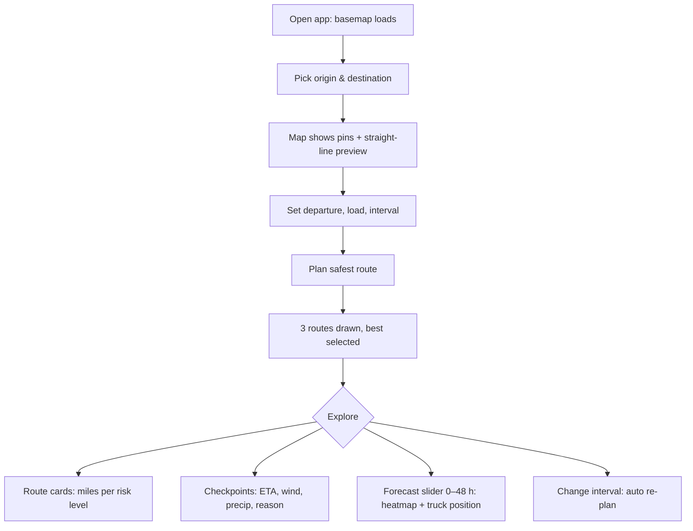
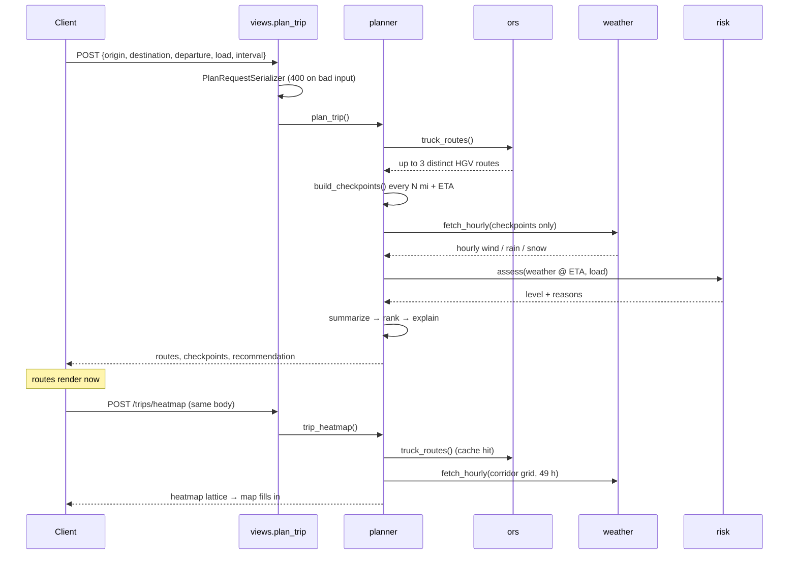
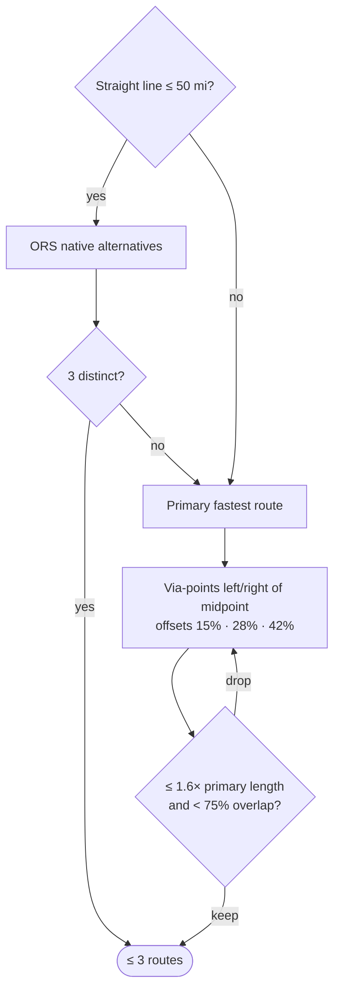
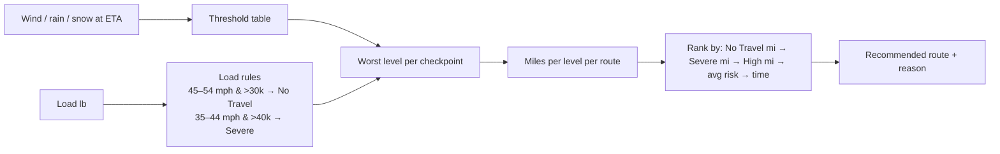
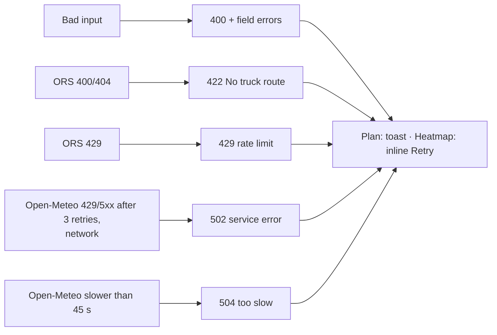

# Application flow

## System

```mermaid
flowchart LR
  U([Driver]) --> C[React client<br/>Vite · MapLibre · deck.gl]
  C -- /api/geocode/autocomplete --> S[Django API]
  C -- /api/trips/plan --> S
  C -- /api/trips/heatmap --> S
  S -- geocode + HGV routes --> ORS[(OpenRouteService)]
  S -- hourly forecast --> OM[(Open-Meteo)]
  S --- K[(LocMem cache<br/>routes 1h · weather 30m · geocode 24h)]
```

## User journey

```mermaid
flowchart TD
  A[Open app: basemap loads] --> B[Pick origin & destination]
  B --> C[Map shows pins + straight-line preview]
  C --> D[Set departure, load, interval]
  D --> E[Plan safest route]
  E --> F[3 routes drawn, best selected]
  F --> G{Explore}
  G --> H[Route cards: miles per risk level]
  G --> I[Checkpoints: ETA, wind, precip, reason]
  G --> J[Forecast slider 0–48 h: heatmap + truck position]
  G --> K[Change interval: auto re-plan]
```

## Plan request (server)

```mermaid
sequenceDiagram
  participant C as Client
  participant V as views.plan_trip
  participant P as planner
  participant O as ors
  participant W as weather
  participant R as risk

  C->>V: POST {origin, destination, departure, load, interval}
  V->>V: PlanRequestSerializer (400 on bad input)
  V->>P: plan_trip()
  P->>O: truck_routes()
  O-->>P: up to 3 distinct HGV routes
  P->>P: build_checkpoints() every N mi + ETA
  P->>W: fetch_hourly(checkpoints only)
  W-->>P: hourly wind / rain / snow
  P->>R: assess(weather @ ETA, load)
  R-->>P: level + reasons
  P->>P: summarize → rank → explain
  P-->>C: routes, checkpoints, recommendation
  Note over C: routes render now
  C->>V: POST /trips/heatmap (same body)
  V->>P: trip_heatmap()
  P->>O: truck_routes() (cache hit)
  P->>W: fetch_hourly(corridor grid, 49 h)
  P-->>C: heatmap lattice → map fills in
```

## Getting 3 routes

```mermaid
flowchart TD
  S{Straight line ≤ 50 mi?} -- yes --> N[ORS native alternatives]
  S -- no --> P[Primary fastest route]
  N --> Q{3 distinct?}
  Q -- yes --> Done
  Q -- no --> P
  P --> V[Via-points left/right of midpoint<br/>offsets 15% · 28% · 42%]
  V --> F{≤ 1.6× primary length<br/>and < 75% overlap?}
  F -- keep --> Done([≤ 3 routes])
  F -- drop --> V
```

## Risk → recommendation

```mermaid
flowchart LR
  W[Wind / rain / snow at ETA] --> T[Threshold table]
  L[Load lb] --> LR[Load rules<br/>45–54 mph & >30k → No Travel<br/>35–44 mph & >40k → Severe]
  T --> M[Worst level per checkpoint]
  LR --> M
  M --> MI[Miles per level per route]
  MI --> RK[Rank by: No Travel mi → Severe mi → High mi → avg risk → time]
  RK --> REC[Recommended route + reason]
```

## Errors

```mermaid
flowchart LR
  E1[Bad input] --> X1[400 + field errors]
  E2[ORS 400/404] --> X2[422 No truck route]
  E3[ORS 429] --> X3[429 rate limit]
  E4[Open-Meteo 429/5xx after 3 retries,<br/>network] --> X4[502 service error]
  E5[Open-Meteo slower than 45 s] --> X5[504 too slow]
  X1 & X2 & X3 & X4 & X5 --> T[Plan: toast · Heatmap: inline Retry]
```
